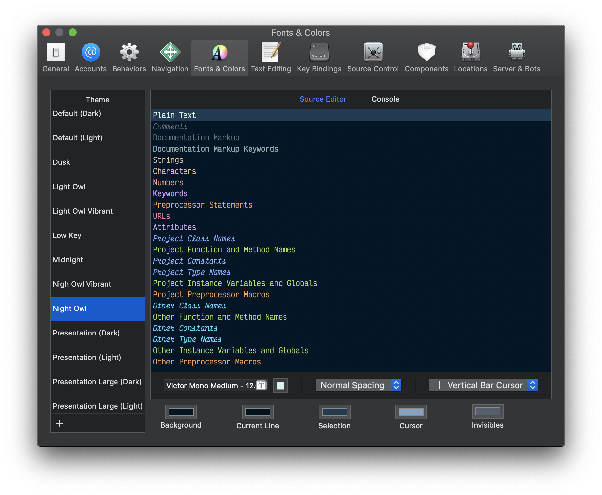
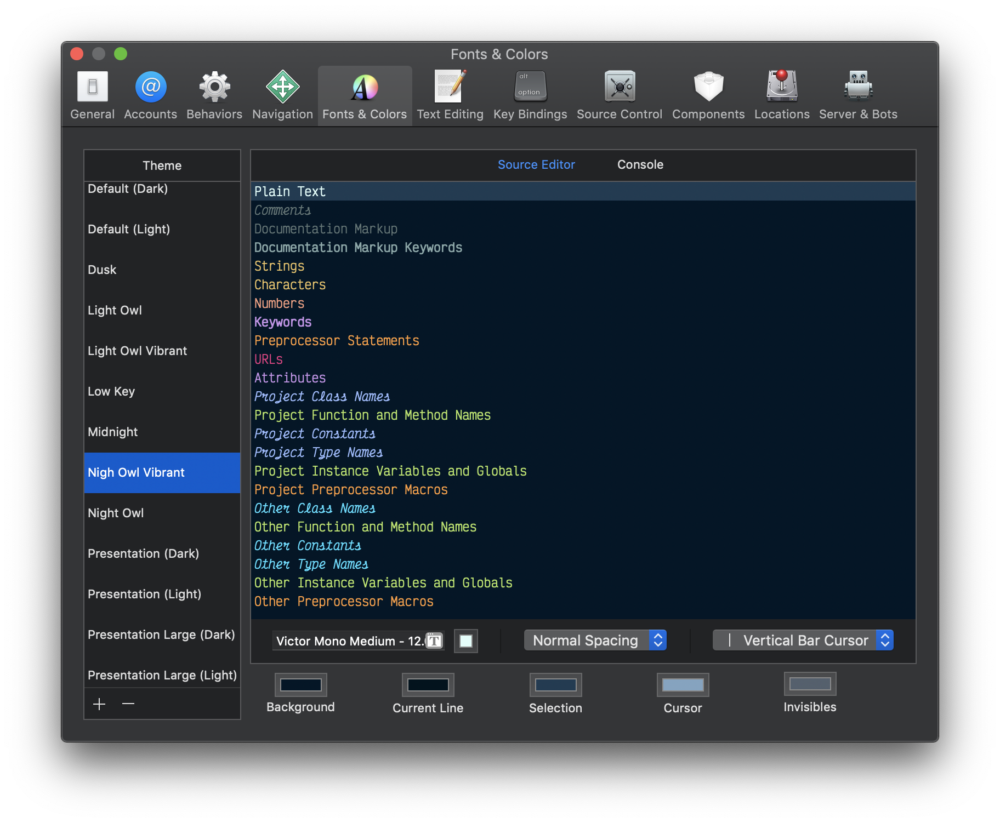
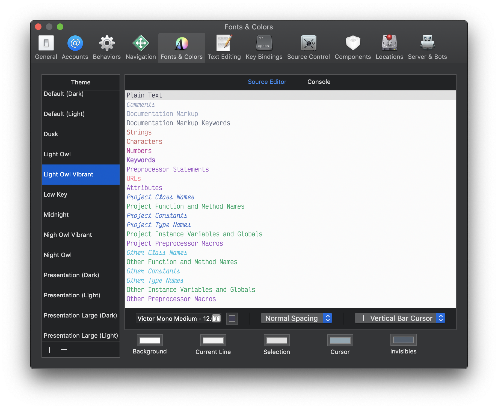

# Xcode-Night-Owl 🦉

This is my own slightly customized version of [Sarah Drasner’s](https://github.com/sdras) Night Owl theme.

## Differences

- The font used is [Victor Mono](https://rubjo.github.io/victor-mono/) for beautiful italics and coding ligatures
- Some minor color adjustments for class names, type names and constants

## Installation

1. Navigate to `/Users/<user_name>/Library/Developer/Xcode/UserData/FontAndColorThemes`
2. Copy the contents of the `themes` folder into the directory
3. Open Xcode and open the preferences
4. In the `Fonts & Colors` tab, select `Night Owl` or `Light Owl` from the list.

## Screenshots

#### Night Owl

#### Night Owl Vibrant

#### Light Owl

#### Light Owl Vibrant

